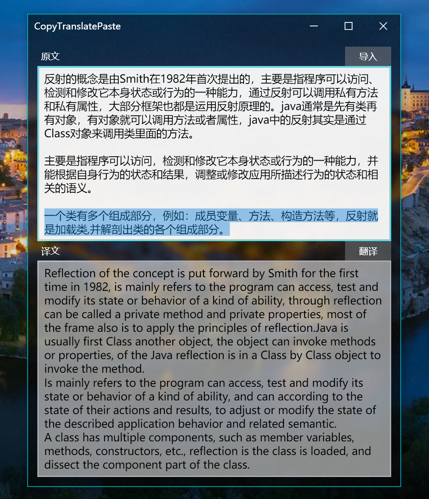
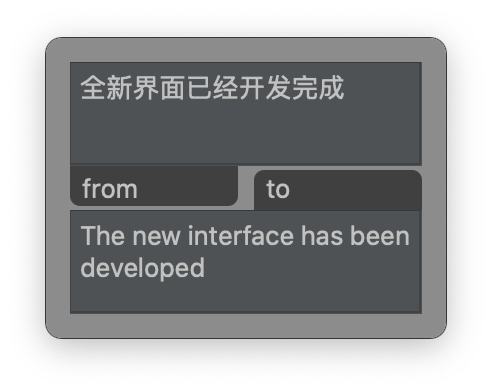
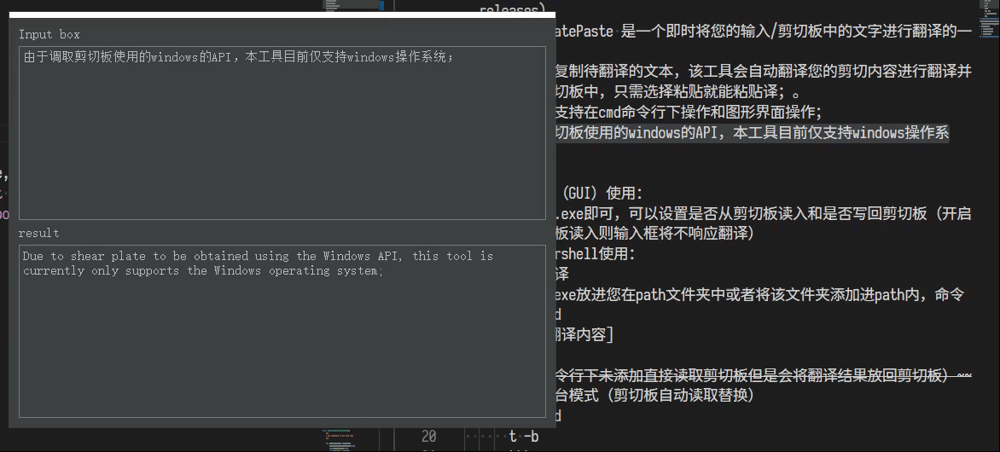
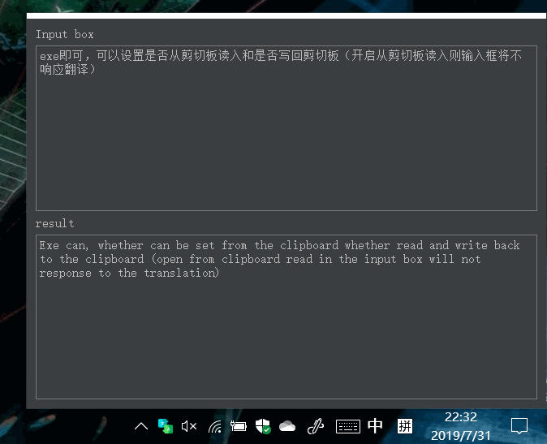

## CopyTranslatePaste

 
 
<svg width="128px" height="128px" viewBox="0 0 16 16" class="bi bi-spellcheck" fill="currentColor" xmlns="http://www.w3.org/2000/svg">
    <path fill-rule="evenodd" d="M8.217 11.068c1.216 0 1.948-.869 1.948-2.31v-.702c0-1.44-.727-2.305-1.929-2.305-.742 0-1.328.347-1.499.889h-.063V3.983h-1.29V11h1.27v-.791h.064c.21.532.776.86 1.499.86zm-.43-1.025c-.66 0-1.113-.518-1.113-1.28V8.12c0-.825.42-1.343 1.098-1.343.684 0 1.075.518 1.075 1.416v.45c0 .888-.386 1.401-1.06 1.401zm-5.583 1.035c.767 0 1.201-.356 1.406-.737h.059V11h1.216V7.519c0-1.314-.947-1.783-2.11-1.783C1.355 5.736.75 6.42.69 7.27h1.216c.064-.323.313-.552.84-.552.527 0 .864.249.864.771v.464H2.346C1.145 7.953.5 8.568.5 9.496c0 .977.693 1.582 1.704 1.582zm.42-.947c-.44 0-.845-.235-.845-.718 0-.395.269-.684.84-.684h.991v.538c0 .503-.444.864-.986.864zm8.897.567c-.577-.4-.9-1.088-.9-1.983v-.65c0-1.42.894-2.338 2.305-2.338 1.352 0 2.119.82 2.139 1.806h-1.187c-.04-.351-.283-.776-.918-.776-.674 0-1.045.517-1.045 1.328v.625c0 .468.121.834.343 1.067l-.737.92z" />
    <path fill-rule="evenodd" d="M14.469 9.414a.75.75 0 0 1 .117 1.055l-4 5a.75.75 0 0 1-1.116.061l-2.5-2.5a.75.75 0 1 1 1.06-1.06l1.908 1.907 3.476-4.346a.75.75 0 0 1 1.055-.117z" />
</svg>

### 截图/复制即译，自动粘贴

[下载](https://github.com/HanyuuLu/CopyTranslatePaste/releases)

CopyTranslatePaste 是一个可以自动读取剪切板中的文字和图片进行翻译的一个工具；受困于经常要翻译各种格式和排版的论文，作者想要一个能够高效快速的翻译工具，求人不如求己，为了能让有类似需求的同学可以不再受到类似的困扰，作者开源了这个项目。

**⚠ 警告 ⚠：本项目为非盈利的开源项目，滥用项目代码、工程制品等造成的任何后果，本人一概不承担任何责任，有关许可信息请详见项目[LICENSE](.\LICENSE)，直接或者间接使用项目代码、工程制品等视为您已知情并同意。**

###  v3.x界面预览（正在开发的版本，基于.net重构）

*   [x] OCR（2021/02/01）
*   [ ] 从剪切板读取文本
*   [ ] 从剪切板读取图片
*   [ ] 翻译结果写回剪切板
*   [x] 翻译接口（2021/02/01）
*   [x] 长文本翻译接口（2021/02/01）
*   [ ] 逐句对照
*   [x] Fluent design 毛玻璃特效UI（2021/02/01）
*   [ ] 设置中心
	*   [ ] 窗口置顶
	*   [ ] 自适应缩放窗口
	*   [ ] 常驻任务栏
	*   [ ] Toast消息
	*   [ ] 快捷键
*   [ ] 带频率控制的触发翻译

### 

---

### v2.x界面（已失去主流支持，请转到 v3.x）

### v1.x界面（已失去主流支持，请转到 v3.x）

    

---
新版logo取自bootstrap icon，版权归bootstrap所有，非商业性质使用。

