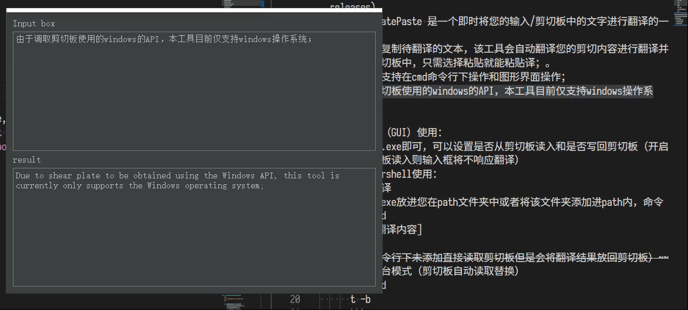
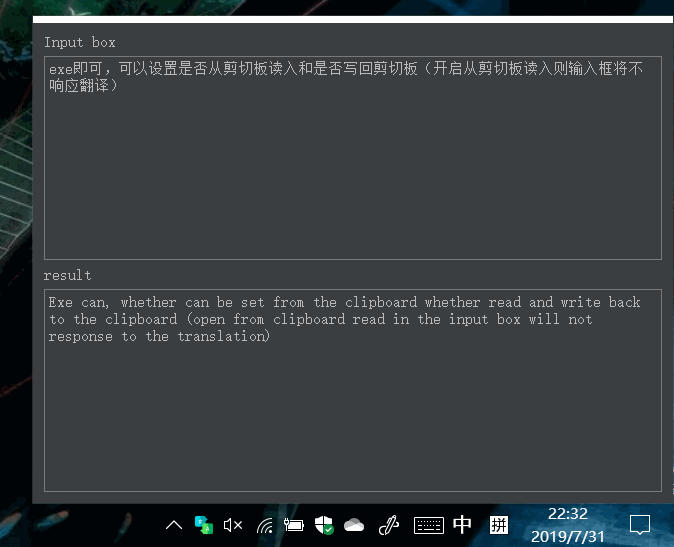

 # Kuro--CopyTranslatePaste
 
 ## 更加贴近您的翻译需求
 
> [下载](https://github.com/HanyuuFurude/CopyTranslatePaste/releases)
* CopyTranslatePaste 是一个即时将您的输入/剪切板中的文字进行翻译的一个工具；
* 您可以直接复制待翻译的文本，该工具会自动翻译您的剪切内容进行翻译并放进您的剪切板中，只需选择粘贴就能粘贴译文。
* 本工具同时支持在cmd命令行下操作和图形界面操作；
* 由于调取剪切板使用的windows的API，本工具目前仅支持windows操作系统；
* 使用方法：
  * 图形界面（GUI）使用：
    

    

    
  * cmd/Powershell使用：
    * 手动翻译
      * 将t.exe放进您在path文件夹中或者将该文件夹添加进path内，命令
      ``` cmd
      t [待翻译内容]
      ```
    * ~~（命令行下未添加直接读取剪切板但是会将翻译结果放回剪切板）~~
    * 常驻后台模式（剪切板自动读取替换）
      ``` cmd
      t -b
      ```
      或者
      ``` cmd
      t --background
      ```

## [开发日志](develop.md)
